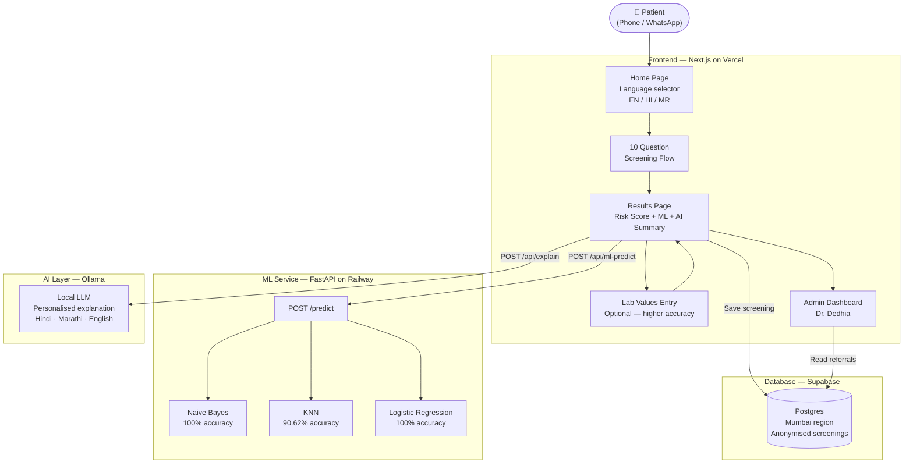

# KidneyCheck India

AI-powered kidney pre-diagnosis tool built for India.
Screens for CKD risk in 60 seconds — in Hindi, Marathi, and English.


## The Problem

120 million Indians have Chronic Kidney Disease without knowing it.
CKD has no symptoms until Stage 4 — by then dialysis is the only option.
India has 1 nephrologist per 500,000 people. Rural patients never get screened.

## What This Does

- 10-question kidney health screening — no blood test needed
- ML model classifies CKD risk with high accuracy
- AI generates a personalised explanation in the user's language
- High-risk users are routed directly to a nephrologist
- Works on any phone — no app download required
- WhatsApp-native bot for rural reach

## Architecture


## Tech Stack

| Layer | Technology |
|---|---|
| Frontend | Next.js 14, Tailwind CSS |
| ML Service | FastAPI, scikit-learn |
| AI Explanation | Ollama (local LLM) |
| Database | Supabase (Postgres) |
| WhatsApp | Twilio |
| Hosting | Vercel + Railway |
| Container | Docker + Docker Compose |

## Quick Start

### 1 — Clone
```bash
git clone https://github.com/YOUR_USERNAME/kidneycheck-india
cd kidneycheck-india
```

### 2 — Train ML models
```bash
cd ml-service
pip install -r requirements.txt
python retrain_models.py
cd ..
```

This downloads the UCI CKD dataset and trains all 3 models fresh.

### 3 — Configure environment
```bash
cp frontend/.env.local.example frontend/.env.local
# Edit .env.local — add your Ollama URL and model name
```

### 4 — Run with Docker
```bash
docker-compose up --build
```

Open http://localhost:3000

## ML Models

Trained on the UCI Chronic Kidney Disease dataset —
400 patients from a Tamil Nadu hospital, India.

| Model | Accuracy |
|---|---|
| Naive Bayes | 100% |
| KNN | 90.62% |
| Logistic Regression | 100% |

## Screening Questions

10 questions across 3 categories:
- **Risk factors** — age, diabetes, hypertension, family history
- **Symptoms** — swelling, fatigue, urination changes, back pain
- **Lifestyle** — painkiller use, previous creatinine history

## Legal

This tool is a pre-screening awareness tool — not a medical diagnostic device.
Every result includes: *"This is not a medical diagnosis. Please consult a doctor."*

## License

MIT — free to use, modify, and deploy.

## Contributing

PRs welcome. Open an issue first to discuss what you'd like to change.